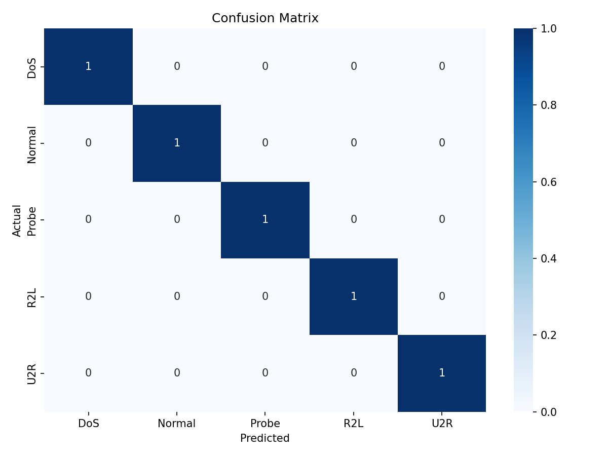

# ICS0019 Advanced python project

## Results

### Dataset info

Training samples: 125973
Test samples: 22544
Number of features: 40

### Class distribution (train - orignal)

| Class  | Count |
|--------|-------|
| Normal | 67343 | 
| DoS    | 45927 | 
| Probe  | 11656 | 
| R2L    | 995   | 
| U2R    | 52    | 

### Class distribution (train - after SMOTE)

| Class  | Count |
|--------|-------|
| Normal | 67343 |
| DoS    | 67343 |
| R2L    | 67343 |
| Probe  | 67343 |
| U2R    | 67343 |

### Cross-validation performance
Macro F1 (CV mean): 0.9998

Macro F1 (CV std):  0.0001

### Classification Report

| Class        | Precision | Recall | F1-score | Support |
|--------------|-----------|--------|----------|---------|
| DoS          | 0.96      | 0.83   | 0.89     | 7460    |
| Normal       | 0.70      | 0.97   | 0.81     | 9711    |
| Probe        | 0.84      | 0.79   | 0.81     | 2421    |
| R2L          | 0.99      | 0.14   | 0.25     | 2885    |
| U2R          | 0.62      | 0.24   | 0.34     | 67      |
| Macro avg    | 0.82      | 0.59   | 0.62     | 22544   |
| Weighted avg | 0.84      | 0.79   | 0.76     | 22544   |

### Per-class F1 scores

| Class  | F1-score |
|--------|----------|
| DoS    | 0.8886   |
| Normal | 0.8143   |
| Probe  | 0.8100   |
| R2L    | 0.2490   |
| U2R    | 0.3441   |

### Cross-validation vs Test Performance

The cross-validation macro F1-score was significantly higher than the test score. This discrepancy is caused by applying
SMOTE before cross-validation, which introduces data leakage. Synthetic samples generated by SMOTE can appear in both
training and validation folds, leading to overly optimistic cross-validation results.

The final test macro F1-score (0.62) is therefore a more reliable estimate of the model's real-world performance.

### Analysis

The model performs well on majority classes such as DoS, Normal, and Probe, achieving F1-scores above 0.80. However, it
struggles with minority classes, particularly R2L and U2R.

The confusion matrix shows that most R2L attacks are misclassified as Normal traffic, indicating that these attacks
share similar feature patterns with legitimate connections. Although SMOTE was used to address class imbalance, the
model still has difficulty learning meaningful patterns for rare attack types.

U2R detection remains limited due to the extremely small number of samples in the dataset.

## Confusion matrix

